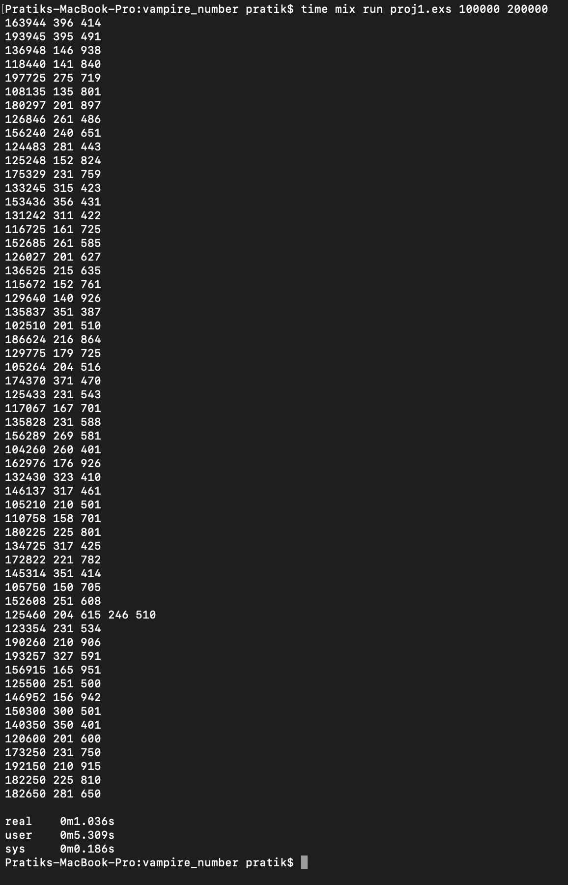

# VampireNumber

**TODO: Add description**

## Readme File

1. Group Members: 
	Dipen Jain 					UFID: 15521903
	Anushka Sudhir Linge		UFID: 77530821

Steps to run Code:
	1. Download the zip file and unzip it at any location.
	2. Open the command prompt / terminal
	3. Change the directory to the directory where the file was unzipped, using cd command
	   For example if the folder is unzipped at C:\users\username\desktop\foldername
	   Use the following command in Windows: cd pathname
	4. Then type the following command to run the code - mix run proj1.exs 100000 200000

2. The number of worker actors are decided on the range of the numbers. The range of input is divided
   into batches and each batch is given to a worker.

   Number of Worker Actors = Range of Numbers/Batch Size 
   In this case range of numbers = 100000; Batch Size = 50
   Number of worker actors = 2000

3. Size of the work unit of each worker = batch size = 50 numbers
   Explanation: 
   Having tried for a couple of batch sizes and input ranges below are the results we achieved.

   Batch size		Range of input			Ratio of cpu to real time
   50				   100000 - 200000			5.46
   50				   10000 - 2000000   		7.07
   50				   1000 - 2000000          7.4
   50				   1000 - 5000000          7.11
   50				   1000 - 9000000          6.88
   50				   1000 - 10000000         6.897

   100            100000 - 200000         5.58
   100            100000 - 600000         6.9

   1000				100000 - 200000         4.786
   1000				1000 - 200000           timeout
   
   The results show that the ratio holds good and works across a larger range of numbers. for the decided batch size of 50 numbers. Hence each worker is given 50 numbers to check.

4. Result of running mix run proj1.exs 100000 200000

<!--
Pratiks-MacBook-Pro:vampire_number pratik$ time mix run proj1.exs 100000 200000
163944 396 414
193945 395 491
136948 146 938
118440 141 840
197725 275 719
108135 135 801
180297 201 897
126846 261 486
156240 240 651
124483 281 443
125248 152 824
175329 231 759
133245 315 423
153436 356 431
131242 311 422
116725 161 725
152685 261 585
126027 201 627
136525 215 635
115672 152 761
129640 140 926
135837 351 387
102510 201 510
186624 216 864
129775 179 725
105264 204 516
174370 371 470
125433 231 543
117067 167 701
135828 231 588
156289 269 581
104260 260 401
162976 176 926
132430 323 410
146137 317 461
105210 210 501
110758 158 701
180225 225 801
134725 317 425
172822 221 782
145314 351 414
105750 150 705
152608 251 608
125460 204 615 246 510
123354 231 534
190260 210 906
193257 327 591
156915 165 951
125500 251 500
146952 156 942
150300 300 501
140350 350 401
120600 201 600
173250 231 750
192150 210 915
182250 225 810
182650 281 650

real	0m1.036s
user	0m5.309s
sys	0m0.186s
 
-->

5. For the above case

   Running Times:

   real	0m1.036s
   user	0m5.309s
   sys	0m0.186s
   
   Ratio of CPU time to REAL time = (user+sys)/real = 5.46

6. Largest Problem solved using the batch size mentioned above.
10000000 command used - time mix run proj1.exs 1 10000000
Largest vampire number : 939658 953 986
<!-- 
vampire_number pratik$ time mix run proj1.exs 1 10000000
414895 491 845
284598 489 582
338296 392 863
315594 534 591
226498 269 842
362992 392 926
361989 369 981
251896 296 851
233896 338 692
736695 765 963
559188 588 951
416988 468 891
829696 896 926
371893 383 971
211896 216 981
841995 891 945
369189 381 969
769792 776 992
729688 788 926
428980 482 890
262984 284 926
794088 807 984
475380 570 834
245182 422 581
205785 255 807
516879 681 759
792585 855 927
180297 201 897
156289 269 581
629680 680 926
218488 248 881
312475 431 725
312975 321 975
263074 437 602
226872 276 822
124483 281 443
346968 366 948
529672 572 926
152685 261 585
404968 446 908
392566 593 662
174370 371 470
429664 464 926
213466 341 626
162976 176 926
115672 152 761
241564 461 524
284760 420 678
336960 360 936
129775 179 725
319059 351 909
125460 204 615 246 510
117067 167 701
110758 158 701
215860 251 860
329656 356 926
190260 210 906
105264 204 516
201852 252 801
489159 549 891
193257 327 591
326452 524 623
173250 231 750
253750 350 725
104260 260 401
341653 533 641
140350 350 401
105750 150 705
136948 146 938
229648 248 926
738468 843 876
489955 545 899
6880 80 86
336550 530 635
126846 261 486
123354 231 534
378450 435 870
146952 156 942
182250 225 810
182650 281 650
192150 210 915
368550 585 630
416650 641 650
125248 152 824
2187 27 81
133245 315 423
156240 240 651
193945 395 491
163944 396 414
329346 342 963
135837 351 387
153436 356 431
1395 15 93
217638 321 678
131242 311 422
108135 135 801
254740 470 542
118440 141 840
125433 231 543
498550 590 845
129640 140 926
1260 21 60
260338 323 806
146137 317 461
538650 630 855
1435 35 41
1530 30 51
1827 21 87
116725 161 725
126027 201 627
135828 231 588
136525 215 635
132430 323 410
216733 323 671
175329 231 759
319536 336 951
365638 533 686
567648 657 864
134725 317 425
568750 650 875
809964 894 906
638950 650 983
197725 275 719
172822 221 782
180225 225 801
186624 216 864
456840 540 846
458640 546 840
156915 165 951
102510 201 510
105210 210 501
145314 351 414
815958 858 951
536539 563 953
152608 251 608
120600 201 600
125500 251 500
296320 320 926
286416 468 612
150300 300 501
304717 431 707
789250 875 902
939658 953 986
378418 431 878
386415 465 831
486720 624 780
384912 432 891
447916 476 941
315900 351 900
378400 473 800
673920 720 936
457600 650 704
789525 825 957
809919 891 909
679500 750 906

real	0m18.714s
user	2m1.383s
sys	0m1.913s
-->